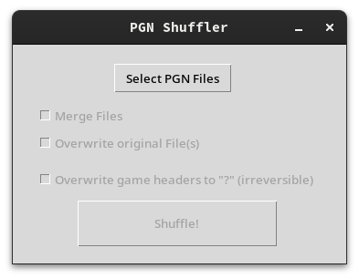

# Chess-PGN-Shuffler
Small program in python to shuffle and merge all of your chess games.



## Installation
[Pre-built binaries](https://github.com/publicvoid1337/Chess-PGN-Shuffler/releases) are available for Windows and Linux, but you can also choose to compile from source.


Clone the repository or download the source code manually.

```
 ~ git clone https://github.com/publicvoid1337/Chess-PGN-Shuffler
 ~ cd Chess-PGN-Shuffler
```

Install python and the required libraries. You can install these globally or in a virtual environment.

```
 ~ pip install chess pyinstaller
```

Compile via pyinstaller.

```
 ~ pyinstaller -F --windowed ui.py
```

Your executable will be located in the dist folder.